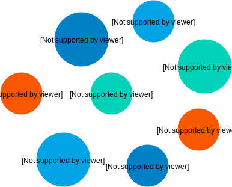
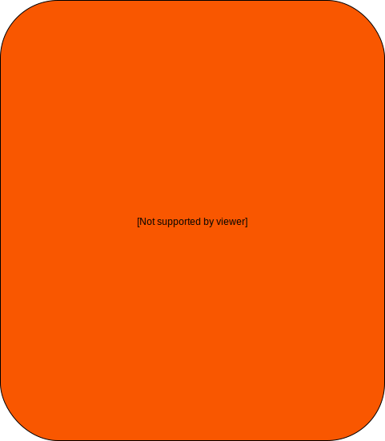
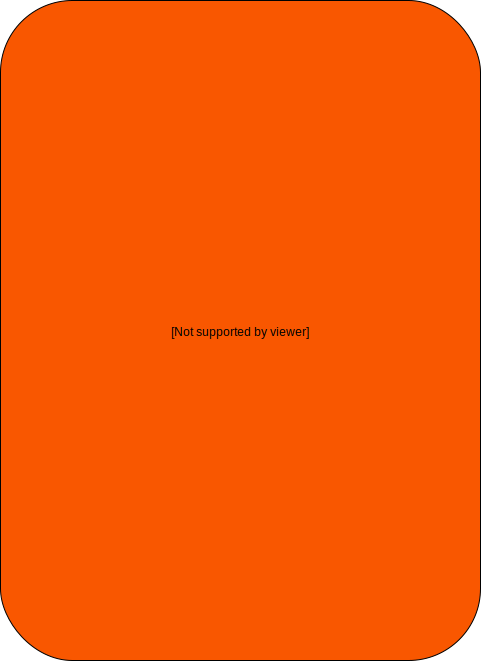
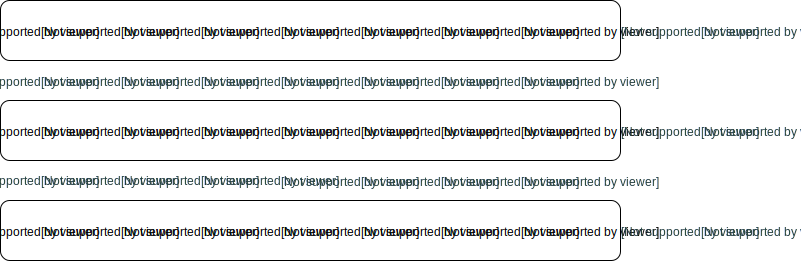
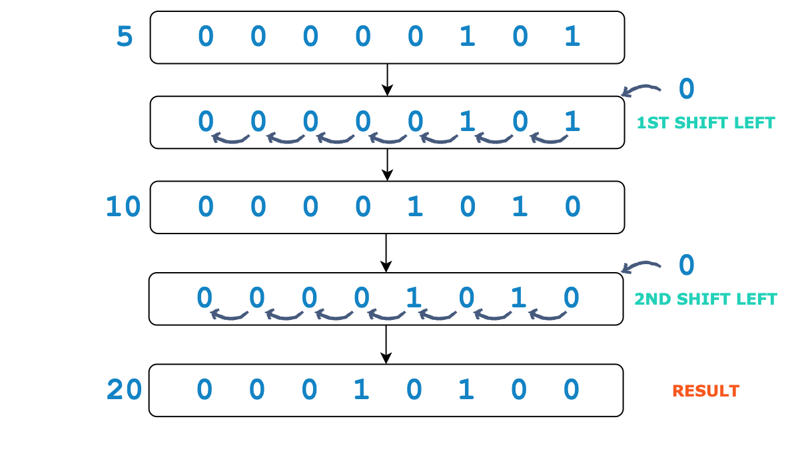
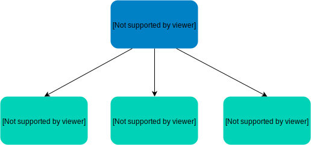

# Dart Programming

Dart has the best of all other programming languages.Dart code runs inside of isolates. Each isolate has its own **memory heap**, ensuring that no isolate’s state is accessible from any other isolate.

Dart is a programming language optimized for building user interfaces with features for expanding collections, and for customizing the UI for each platform.

> **HOT RELOAD IN FLUTTER**
>
> Hot reload works by injecting updated source code files into the running Dart Virtual Machine (VM). After the VM updates classes with the new versions of fields and functions, the Flutter framework automatically rebuilds the widget tree, allowing you to quickly view the effects of your changes.

Dart has an AOT (Ahead of Time) compiler, which compiles to fast, predictable, native code that allows almost all of Flutter to be written in Dart. This not only makes Flutter fast but ensures that virtually everything (including all the widgets) can be customized.

Dart starting point

```dart
void main(){
  // code here
}
```

```dart
main() {
  // Printing the text 'Hello World'
  print("Hello World");
}
```

Dart is a **Imperative programming**

The code that appears inside of the `main()` function gets executed in order of appearance.

```dart
main() {
  print("Hello World");
  print("From Dart");
}
```

When you run the code above, the print statement on **line 2** will execute first and then the second print statement on **line 3** will execute.

This style of programming is called **imperative programming**. It is essentially a programming paradigm wherein you write a set of instructions that execute in sequential order. Imperative programming doesn’t necessarily describe *what* the program should accomplish, rather it shows *how* the program should accomplish it. So, in this case, we have created a program that goes first and prints out the text *Hello World* and then moves on to the next line and prints the text *From Dart*.

```dart
import 'dart:io';

main() {
    print("Hello " + stdin.readLineSync());
}
```

Dart is Object oriented programming language.

### What is an Object

Every object has *characteristics* and *behaviors*. For instance, a person has characteristics such as their name, age, and height. A person can also perform behaviors such as walking, eating, and sleeping. These characteristics and behaviors combined define who the person is.


In the same way, everything in Dart is an object. Objects in a programming language also have characteristics known as **properties** and they can also perform behaviors known as **methods**. Properties represent what the object knows, and methods represent what the object can do.

### Variables

Variables are used for storing information which can then be used by the computer program.


```dart
main() {
  int myFirstDartVariable = 5;
}
```



### Data types

- Numbers
- Strings
- Booleans
- Lists
- Sets
- Maps
- Runes
- Symbols

## Values and References [#](https://www.educative.io/courses/learn-dart-first-step-to-flutter/xVvQvDQ920P#values-and-references)

1. **Reference type**
2. **Value type**

In most languages, primitive data types are value types, but in Dart, **all** data types are objects. This means that even primitive data types are reference types. Therefore, we can say that in Dart, variables specifically store references and are referring to objects.

### Default Value [#](https://www.educative.io/courses/learn-dart-first-step-to-flutter/xVvQvDQ920P#default-value)

Uninitialized variables have an initial value of `null`. Even variables with numeric types are initially `null` because numbers—like everything else in Dart—are objects. `null` simply means that the variable is not referencing an object; it’s not referencing anything.

In the code snippet below, we are creating a variable `notInitialized` without initializing it. When we try to print the value of `notInitialized`, we get `null` as the output.

```dart
main() {
    int notInitialized;
    print(notInitialized);
} 
// null
```

```dart
main() {
  num firstNumber = 5;
  num secondNumber = 5.1;
  num thirdNumber = firstNumber;

  // Driver Code
  print(firstNumber);
  print(secondNumber);
  print(thirdNumber);
}
```

 **Dart numbers are further divided into two subtypes:**

integers (int)
doubles (double)
Both int and double are subtypes of num.

### Strings

A Dart string is a sequence of **UTF-16** code units. **UTF** stands for *Unicode Transformation Format*. [Unicode](https://unicode-table.com/en/#0041) is a set of characters in which each character is a unique code unit.

## String Concatenation

To concatenate two strings means to join them together. Concatenation of two or more strings is done using the `+` operator.

```dart
main() {
  String s1 = "First half of the string. ";
  String s2 = "Second half of the string";
  print(s1 + s2);
}
```


```dart
main() {
  String country = "Japan";

  print("I want to visit $country");
}
```

```dart
main() {
  print("The sum of 5 and 3 equals ${5+3}.");
}
```

```dart
main() {
  var s1 = 'String ''test';
  print(s1);
}
// Stringtest
```

```dart
main() {
  var s1 = 'String '
    'concatenation'
    " works even over line breaks.";
    
  print(s1);
}
```

```dart
main() {
  var multilineString = """This is a 
multiline string
consisting of 
multiple lines""";

  print(multilineString);
}
```

## Booleans

```dart
main() {
  bool b1 = true;
  print(b1);
}
```

## Type Inference and Annotation

Dart is strongly typed. Strongly typed languages take extra precaution and have rules and restrictions to ensure that a variable’s value always matches the variable’s static type.Also dart has type interference.

Although types are mandatory in Dart, **type annotations** are optional because of **type inference**

```dart
main() {
  var bookTitle = "Lord of the Rings: The Fellowship of the Ring";
  var bookAuthor = "J. R. R. Tolkien";
  var bookNoOfPages = 423;

  // Driving Code
  print(bookTitle);
  print(bookAuthor);
  print(bookNoOfPages);
}
```

### To know the datatype of a variable

```dart
main() {
  var bookTitle = "Lord of the Rings: The Fellowship of the Ring";

  print(bookTitle.runtimeType);
}
```

#### Using Type Annotations [#](https://www.educative.io/courses/learn-dart-first-step-to-flutter/NE03Lr5M5pD#using-type-annotations)

Remember when we said that variable types are inferred from their initial value? It’s also important to mention that subsequent assignments are not considered. This means that too precise a type may be inferred. If that is not desired, you can add type annotation.

In the example below, we are declaring a variable, `number`, using the `var` keyword. We want the variable to hold any type of number, i.e., `int` and `double`.

```dart
main() {
  var number = 3;
  print(number);

  number = 3.2;
  print(number);
}
```

When you run the code snippet above, you will get an error. When we initialized `number` with an integer, the compiler inferred that `number` is of type `int`. Hence, when we reassigned it a value of type `double`, the compiler displays an error.

Here, we can use type annotation and declare the `number` variable using the `num` data type. Remember that type `num` is generic enough to hold both `int` and `double`.

```dart
main() {
  num number = 3;
  print(number);

  number = 3.2;
  print(number);
}
```

### Dynamic Types [#](https://www.educative.io/courses/learn-dart-first-step-to-flutter/NE03Lr5M5pD#dynamic-types)

```dart
main() {
  dynamic dynamicVariable = 'A string'; // type String
  print(dynamicVariable);

  dynamicVariable = 5; // type int
  print(dynamicVariable);

  dynamicVariable = true; // type bool
  print(dynamicVariable);
}
```


## Compile-Time and Run-Time [#](https://www.educative.io/courses/learn-dart-first-step-to-flutter/myGvnDxnKR0#compile-time-and-run-time)

Compile-time and runtime are programming terms that refer to different stages in a program’s lifetime. In order to create a program, you first write some source code. The source code defines how the program will function.

Now that we know what compilation is, let’s take that as our base and learn about compile-time through an example.

We have been defining some `int` and `double` variables in our programs with initial values. These variables will always have the same initial value whenever we run the program. These values are *fixed* at the time of *compilation*. Such things are said to be fixed at **compile-time**.

### Run and Run-Time [#](https://www.educative.io/courses/learn-dart-first-step-to-flutter/myGvnDxnKR0#run-and-run-time)

After a program is compiled, we can **run** it.

Remember when we took user input from the user in one of the previous [lessons](https://www.educative.io/collection/page/10370001/6069685319630848/4706459042447360)? We could point out that the value displayed by the print statement could change every time we run the program, depending on what the user types. Things that can’t be determined until the program is actually run are said to be fixed at **run-time**.

### Using `final` [#](https://www.educative.io/courses/learn-dart-first-step-to-flutter/myGvnDxnKR0#using-final)

A final variable (a variable created using the `final` keyword) is initialized the first time it is used and can only be set once. In other words, the final value will be known at *runtime*.

```dart
import 'dart:io';
 
main() {
  final name = stdin.readLineSync();
  print("Hello " + name);
}
```

### Using `const` [#](https://www.educative.io/courses/learn-dart-first-step-to-flutter/myGvnDxnKR0#using-const)

A constant variable (a variable created using the `const` keyword) should be created when you know the value at *compile-time*. Like a final variable, a constant variable can also only be set once

```dart
main() {
  const name = "Bob";

  // Driver Code
  print(name);
}
```

## Types of Operators

Operators are symbols that perform *operations* used for modifying or manipulating data. Manipulating data is an essential part of any programming language, and Dart is no different, providing a rich set of operators for its basic types.

- Arithmetic Operators
- Equality and Relational Operators
- Type Test Operators
- Assignment Operators
- Logical Operators
- Bitwise and Shift Operators

Expressions are composed of two things; *operands* and *operators*.


### Arithmetic Operators

| **Operator** | **Use**                                                      |
| ------------ | ------------------------------------------------------------ |
| `+`          | Adds two operands                                            |
| `-`          | Subtracts the second operand from the first                  |
| `-`expr      | Reverses the sign of the expression (unary minus)            |
| `*`          | Multiplies both operands                                     |
| `/`          | Divides the first operand by the second operand.(Gives the exact value of division ). |
| `~/`         | Divides the first operand by the second operand and returns an integer value(Divides and gives only the integer value) |
| `%`          | Gets the remainder after division of one number by another   |

```dart
main() {
  var operand1 = 10;
  var operand2 = 7;

  print(operand1 + operand2);
  print(operand1 - operand2);
  print(- operand1);
  print(operand1 * operand2);
  print(operand1 / operand2);
  print(operand1 ~/ operand2);
  print(operand1 % operand2);
}

// 17
// 3
// -10
// 70
// 1.4285714285714286
// 1
// 3
```

| **Operator** | **Use**       |
| ------------ | ------------- |
| `++`var      | var = var + 1 |
| var`++`      | var = var + 1 |
| `--`var      | var = var - 1 |
| var`--`      | var = var - 1 |

### ++var [#](https://www.educative.io/courses/learn-dart-first-step-to-flutter/gxq6pGZ414G#var)

The expression value of `++var` is `var+1`. When we insert the expression in a print statement, the compiler first increments the variable by **1** and then prints the value of the variable.

```dart
main() {
  var prefixIncrement = 5;

  print(++prefixIncrement);
}

// 6
```

### var++ [#](https://www.educative.io/courses/learn-dart-first-step-to-flutter/gxq6pGZ414G#var-2)

The expression value of `var++` is `var`. When we insert the expression in a print statement, the compiler first prints the value of the variable and then increments it by **1**.

```dart
main() {
  var postfixIncrement = 5;

  print(postfixIncrement++);
  print(postfixIncrement);
}

// 5
// 6
```

### - -var [#](https://www.educative.io/courses/learn-dart-first-step-to-flutter/gxq6pGZ414G#-var)

The expression value of `--var` is `var-1`. When we insert the expression in a print statement, the compiler first decrements the variable by **1** and then prints the value of the variable.

```dart
main() {
  var prefixDecrement = 5;

  print(--prefixDecrement);
}

// 4
```

### var- - [#](https://www.educative.io/courses/learn-dart-first-step-to-flutter/gxq6pGZ414G#var-)

The expression value of `var--` is `var`. When we insert the expression in a print statement, the compiler first prints the value of the variable and then decrements it by **1**.

```dart
main() {
  var postfixDecrement = 5;

  print(postfixDecrement--);
  print(postfixDecrement);
}
// 5
// 4
```


### Equality and Relational Operators


| **Operator** | **Use**                                                      |
| ------------ | ------------------------------------------------------------ |
| `==`         | Checks if the values of the two operands are equal (true if equal) |
| `!=`         | Checks if the values of the two operands are not equal (true if not equal) |
| `>`          | Checks if the value of the left operand is greater than the value of the right operand |
| `<`          | Checks if the value of the left operand is less than the value of the right operand |
| `>=`         | Checks if the value of the left operand is greater than or equal to the value of the right operand |
| `<=`         | Checks if the value of the left operand is less than or equal to the value of the right operand |


### Type Test Operators


| Operator | Use                                        |
| -------- | ------------------------------------------ |
| `as`     | typecast                                   |
| `is`     | True if the object has the specified type  |
| `is!`    | False if the object has the specified type |


```dart
main() {
  double type1 = 5.0;
  int type2 = 87;
  String type3 = "educative";
  bool type4 = true;

  print(type1 is int);
  print(type2 is int);
  print(type3 is String);
  print(type4 is double);
  print(type4 is! double);
}

// false
// true
// true
// false
// true
```


### Assignment Operators


### Compound Assignment Operators 

| =    | -=   | /=   | %=   | >>=  | ^=   |
| ---- | ---- | ---- | ---- | ---- | ---- |
| +=   | *=   | ~/=  | <<=  | &=   | \|=  |


It’s equivalent to the following:


`+=`

```dart
main() {
  var A = 10;
  var B = 7;
  
  print("Before using a compound assignment operator:");
  print(A);

  A += B;

  print("After using a compound assignment operator:");
  print(A);
}

// 10
// 17
```

### `&=` (performs binary AND)

```dart
main() {
  var A = 10;
  var B = 7;
  
  print("Before using a compound assignment operator:");
  print(A);

  A &= B;

  print("After using a compound assignment operator:");
  print(A);
}
```


### Logical Operators

| **Operator** | **Name**    | **Use**                                                      |
| ------------ | ----------- | ------------------------------------------------------------ |
| `!`          | Logical NOT | Reverses the logical state of its operand. If a condition is true, then the Logical *NOT* operator will make it false |
| `||`         | Logical OR  | If any of the two operands is not false, then the result is true |
| `&&`         | Logical AND | If both the operands are not false, then the result is true  |


> `!` is a unary operator, i.e., it takes one operand.



```dart
main() {
  var A = true;
  var B = false;
  var expr = A && B; //false

  print(!A); // !true --> false
  print(!B); // !false --> true
  print(true || expr); // true || expr --> true
  print(false || expr); // false || expr --> expr
  print(true && expr); // true && expr --> expr
  print(false && expr); // false && expr --> false
}
```


### Bitwise and Shift Operators


| **Operator** | **Name**                     | **Use**                                                      |
| ------------ | ---------------------------- | ------------------------------------------------------------ |
| `&`          | Bitwise **AND**              | If the corresponding bit in both operands is **1** it will give a **1**, else **0** |
| `|`          | Bitwise **OR**               | If the corresponding bit in at least one operand is **1** it will give a **1**, else **0** |
| `^`          | Bitwise **XOR**              | If the corresponding bit in only one operand is **1** it will give a **1**, else **0**. Same 0 different 1 |
| `~`          | Unary Bitwise **Complement** | Bits which are **0** become **1** and bits which are **1** become **0** [+12 => (-)13][-12 => (+)11] |

### Shift Operator

| **Operator** | **Name**    | **Use**                                                      |
| ------------ | ----------- | ------------------------------------------------------------ |
| `<<`         | Shift Left  | Shifts all the bits of its operand to the left by the specified amount |
| `>>`         | Shift Right | Shifts all the bits of its operand to the right by the specified amount |

> Both bitwise and shift operators work on binary numbers.
>
> The numbers are stored in binary form. However, we see the operands and the results in decimal, while the operations take place in binary.





### Right Shift




### Precedence Table

| **Description** | **Operator**                                  |
| --------------- | --------------------------------------------- |
| Unary postfix   | `.`, `?.`, `++`, `--`, `[``]`, `()`           |
| Unary prefix    | `-`, `!`, `˜`, `++`, `--`, `await`            |
| Multiplicative  | `*`, `/`, `˜/`, `%`                           |
| Additive        | `+`, `-`                                      |
| Shift           | `<<`, `>>`, `>>>`                             |
| Bitwise AND     | `&`                                           |
| Bitwise XOR     | `ˆ`                                           |
| Bitwise OR      | `|`                                           |
| Relational      | `<`, `>`, `<=`, `>=`, `as`, `is`, `is!`       |
| Equality        | `==`, `!=`                                    |
| Logical AND     | `&&`                                          |
| Logical Or      | `||`                                          |
| If-null         | `??`                                          |
| Conditional     | `?` `:`                                       |
| Cascade         | `..`                                          |
| Assignment      | `=`, `*=`, `/=`, `+=`, `-=`, `&=`, `ˆ=`, etc. |

## Dart Collections

#### Functions

In computer programming, a function or a method is a block of code that performs a specific task. The block of code is given a name, much like a variable. The function is called using this name whenever that specific task needs to be performed. This removes the need to type the same code over and over again; all you have to do is call the function’s name.

Like mathematical functions, programming functions take in an input, known as an **argument**, perform some operations on that input, and then return the resulting output.


We can divide functions into two broad categories:

- Built-In Functions
- User-Defined Functions

Examples

```dart
main() {
  String s1 = "hello";
  print(s1.indexOf("o"));
}
```

## Collections

**Collections** are objects that group other objects together according to a conceptual schema. For example, a dictionary is a collection of words and a card deck is a collection of cards.

Another name for collections is *data structures* and there is a good reason for that. **Data structures** are a means of structuring data. They are used to store, manipulate, and retrieve all types of data.




`List`, `Set`, and `Map` are all types in Dart. A variable can be of the above three types along with the primitive types.

### List: The Dart Array

**Lists** are an *ordered* collection of objects. This means that every element in a list has a fixed position. Use a List when you need to access objects by index.

### Creating a List [#](https://www.educative.io/courses/learn-dart-first-step-to-flutter/qAEGvv8k8V7#creating-a-list)

#### * Using Literals

The simplest way is using literals along with square brackets (`[]`).


```dart
main() {
  var simpleList = [1,2,3];

  print(simpleList);
}
```

> Remember how we said that `List` is a type when we were discussing [data types](https://www.educative.io/collection/page/10370001/6069685319630848/5618358982541312)? Well in the code above, Dart [infers](https://www.educative.io/collection/page/10370001/6069685319630848/5672642201780224) that `simpleList` has a type `List` (a `List` with elements of type `int`).

#### Using a Constructor [#](https://www.educative.io/courses/learn-dart-first-step-to-flutter/qAEGvv8k8V7#using-a-constructor)

You can also declare a list using a *List constructor*. A **List constructor** creates an object using the `List` keyword followed by parenthesis (`()`).


```dart
main() {
  var listOfVegetables = List();

  print(listOfVegetables);
}
```

```dart
main() {
  var listOfVegetables = List(2);

  print(listOfVegetables);
}
```

#### List with Type

Instead of depending on Dart’s type inference, we can specify the type that a list should contain.


```dart
main() {
  var listOfVegetables = List<String>();

  print(listOfVegetables is List<String>);
}
// true
```

Lists use zero-based indexing. This means that the first element of a list is located at the **0th** index.


Since each element has its own position, a list can contain duplicates of a single element because each duplicate is still unique in its position

#### Accessing an Element [#](https://www.educative.io/courses/learn-dart-first-step-to-flutter/qVqzogoyYBG#accessing-an-element)


```dart
main() {
  var listOfVegetables = ['potato', 'carrot', 'cucumber'];

  print(listOfVegetables[1]);
}
```

#### Finding the Length of a List

The length of a list is simply the number of elements in that list. To find the length of a list, we can access the `length` property. To access any property we use the dot operator (`.`).


```dart
main() {
  var listOfVegetables = ['potato', 'carrot', 'cucumber'];

  print(listOfVegetables.length);
}
```

#### Adding a Single Element

We can add a single element to the end of an already existing list using the `add` method. The only condition is that the element you add must be of the same type as the elements of the list.


```dart
main() {
  var listOfVegetables = ['potato', 'carrot', 'cucumber'];

  listOfVegetables.add('cabbage');

  print(listOfVegetables);
}
```

#### Adding Multiple Elements

We can add multiple elements to an already existing list using the `addAll` method. Again, the only condition is that the elements you add must all be of the same type as the elements of the list.

The `addAll` method also has a single parameter which is a list. The list should contain the elements you want to add to an already existing list. The type of the parameter is `List`, where the data type depends on the list you call the method on.

In conclusion, `addAll` basically merges the elements of two lists into one.


```dart
main() {
  var listOfVegetables = ['potato', 'carrot', 'cucumber', 'cabbage'];

  listOfVegetables.addAll(['broccoli', 'zucchini']); 

  print(listOfVegetables);

  var vegetablesToAdd = ['okra', 'capsicum'];

  listOfVegetables.addAll(vegetablesToAdd);

  print(listOfVegetables);
}
```

#### Adding Elements in an Index

```dart
var vegetables = [];
orders.insert(0,'potato');
```

#### Removing a Single Element

To remove a single element from an already existing list, we can use the `removeAt` method which removes the element at the specified index.

The `removeAt` method has a single parameter which is the index of the element you want to remove. The type of the parameter is `int`.


```dart
main() {
  var listOfVegetables = ['potato', 'carrot', 'cucumber', 'cabbage', 'broccoli', 'zucchini'];

  listOfVegetables.removeAt(0);
  print(listOfVegetables);

  listOfVegetables.removeAt(2);
  print(listOfVegetables);
}
```

```dart
main() {
  var listOfVegetables = ['carrot', 'cucumber', 'zucchini'];

  var carrotIndex = listOfVegetables.indexOf('carrot');
  listOfVegetables.removeAt(carrotIndex);

  print(listOfVegetables);
}
```

#### Removing All Elements

```dart
main() {
  var listOfVegetables = ['cucumber', 'zucchini'];

  listOfVegetables.clear();

  print(listOfVegetables);
}
```

## The `map()` Method 

`map()` maps all the items of a list to an expression or statement. For instance, we could have a list of integers and we want to calculate the square of each integer in the list. `map()` could be used to solve such a problem.


```dart
main() {
  var listOfVegetables = ['carrot', 'cucumber', 'zucchini'];
  var mappedVegetables = listOfVegetables.map((vegetable) => 'I love $vegetable');
  print(mappedVegetables);
}

// (I love carrot, I love cucumber, I love zucchini)
```

You might have noticed that the output is not a list, as it does not have square brackets. To transform the result of `map()` to a list we can use the `toList()` method.

```dart
main() {
  var listOfVegetables = ['carrot', 'cucumber', 'zucchini'];
  var mappedVegetables = listOfVegetables.map((vegetable) => 'I love $vegetable').toList();
  print(mappedVegetables);
}

// [I love carrot, I love cucumber, I love zucchini]
```

## Sets

In Dart, a **set** is an *unordered* collection of *unique* items. This means that items do not have a specified position in a set, therefore, a set cannot have duplicates of the same item.

## Creating a Set 

##### * Using Literals

Just like lists, sets can also be created using set literals. The syntax is pretty much the same, the only difference is that list literals use square brackets (`[]`) while set literals use curly brackets (`{}`).


```dart
main() {
  var simpleSet = {1,2,3};

  print(simpleSet);
}
```

sets don’t have duplicates. However, you can still insert duplicates when creating a set, but adding a duplicate item has no effect.

```dart
main() {
  var simpleSet = {1,2,3,3};

  print(simpleSet);
}

// {1, 2, 3}
```

> Dart infers that `simpleSet` has a type `Set`, a `Set` with elements of type `int`.


```dart
main() {
  var setOfNumbers = <num>{1,1.5,2,2.5};

  // Driver Code
  print(setOfNumbers);
}
```

### Creating an Empty Set Using a Constructor


```dart
main() {
  var setOfFruit = <String>{};
  print(setOfFruit);

  Set<String> anotherSetOfFruit = {};
  print(anotherSetOfFruit);
}
```

Just like a List, a Set is a type and is, therefore, an object. This means that sets have particular properties and particular methods that they can perform. Let’s look at some of them below.

#### Adding a Single Item to a Set [#](https://www.educative.io/courses/learn-dart-first-step-to-flutter/RLgOGLVQ7LK#adding-a-single-item-to-a-set)

We can add a single element to an already existing set using the `add` method. The only condition is that the item you add must be of the same type as the other items of the set.


```dart
main() {
  var setOfFruit = <String>{};

  setOfFruit.add('apples');
  setOfFruit.add('bananas');
  setOfFruit.add('oranges');

  print(setOfFruit);
}
```

