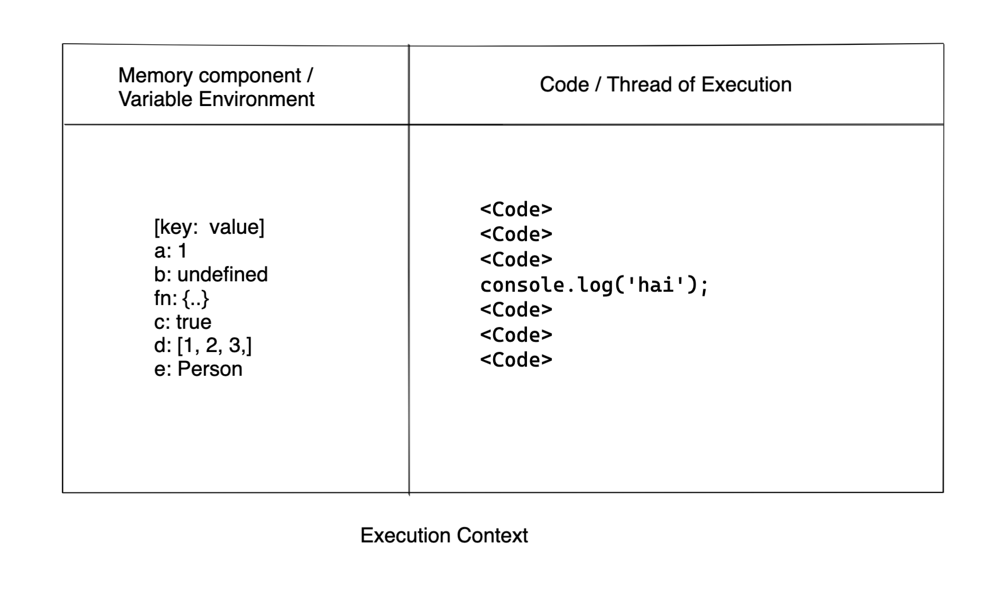

# What is Javascript ?

**Javascript** is a **weekly, dynamically** typed and interpreted language compiles on browser or on a host(server). Originally **Livescript** before and renamed to **Javascript**

> Dynamically typed - Any datatype value can be stored in any variable.In other words, JS assign variable values at run-time.
>
> ```js
> var a = 1;
> a = 'Javascript';
> console.log(a);
> ```
>
> Interpreted - JS code is not pre-compiled but instead compiled, evaluated, executed at runtime

### How do web page works?


### How JS works?


> **Javascript** does not wants **variables** to be decalred before

### Where does JS can run?

* Browser
* Servers


> JS cannot access local file system.

#### Various Js Engines

* Chrome - V8, 
* Firefox - Spider Monkey, 
* IE - Chakra, Nitro
* Safari - SquirrelFish

## History of JS


> ECMA - European Computer Manufacturer Association(Manitains ECMAscript, a language developed ECMA.JS implements in ECMAscript)

### Versions of JS

ES5, ES6 and ....,

### How to include JS in HTML

```html
<script src='path_to_js'></script>
```

> script tag is not a self closing tag. So always close the script tag.

> Also include **script** tag at the end of the file(may be after the body) or use **defer** script

### Core Fundamentals of JS

Everything in JS happens inside of **Execution context**

#### What is Execution context?

Execution context is a big container where the actual code execuets.



Javascript is **synchornous and single threaded** language. Synchronous - One after the other, single threaded - one at a time.

Whenever a JS program runs,a **Execution context** is created

```js
var n = 2;
function square(num){
  var ans = num * num;
  return ans;
}
square2 = square(n);
square4 = square(4);
```

#### Phases of Execution context

1. Memory creation phase
   1. Memory for variables is created and initialized with undefined. 
   2. Memory of functions is created and initialised with function body
2. Code Execution phase
   1. Block of codes will be executed


For JS, maintaining different execution is difficult. But JS does is with the help of **Call stack**

#### How Call stack executes

Call stack maintains the order of execution of execution context.


#### Other Names of Call stack

* Execution context stack
* Control stack
* Program stack
* Runtime stack
* Machine stack

#### Rules of including JS file

* Script required </script>
* Always include JS in seperate file
* Always include JS at the end of the file after body
* Order of JS matters,
  * Any dependent file should be included first
  * Any third party library JS files should be included first

### Variables and Constants

**Variables** are storage containers that stores any value inside of it

```js
var a = 1;
let b = 'JS';
const c = [1, 2, 3];
```

Reassignment of values is possible

```js
var a = 1;
a = 2;
```

#### Let

This declares/initializes a variable that can change.

```js
var a = 1;
a = 2;
```

#### Const

This initializes a variable that cannot change

```js
const a = 1;
a = 2; (Not possible, gives error)
```

> Use **constants** more often as possible.

#### Recommendation of variable naming

* Use camel case(Ex: userName)
* Use constants(const) more often
* Use Meaningful names(Ex: userName, password)

> JS is case sensitive 
>
> ```js
> var a = 1;
> var A = 1;
> ```
>
> The above two are not same

* digits are allowed at last `let age1 = 21;`
* No special characters are allowed except $ `let $myage = 21; `
* _ is allowed `let _myAge = 21;` but dont use at the word seperation(Ex: user_name).In other words **snake casing** is not recommended
* should not start with digits and special characters except $ `let 12Age = 21;`
* No keywords are allowed as variable name `let while = 1`, while is  keyword

#### Declartion

```js
let a;
```

#### Initialization

```js
let a = 0;
```

> Print any value to output using **console.log()**
>
> ```js
> let a = 0;
> console.log(a); // 0
> ```

```js
var a;
console.log(a); //undefined
```

```js
console.log(a); // "ReferenceError: a is not defined
```

> undefine and not defined are not same. Undefined means a is created and contains no value. But not defined, a is not at all created.

#### Hoisting

2 Golden Rules of Hoisting

Befor the execution of any JS code,

* All variable declaration will be scanned and made undefined
* All functions are scanned and made available

```js
getName(); // Hello JS
console.log(getName); // f getName{...}
console.log(x); // undefined

x = 1;
function getName(){
  console.log('Hello JS');
}
```

Applying the Golden Rule of JS,

* Even before the execution of code, variable **x** will be hoisted with value of undefined, Function **getName()** is created and made available

#### Operators

Operators are used for data manipulation. This includes `+`, `-`, `*`, `/`, `%`, `=`, `&&`, `||`, `?`, `*=`, `+=`, `++`, `--` and more.

### Functions

**Functions** are used to avoid duplication of codes.

```js
function a(){
  var x = 1;
  console.log(x);
}

a(); // 1
```

#### Basic understanding of how function works

```js
var x = 1;
a();
b();
console.log(x);

function a(){
  var x = 10;
  console.log(x);
}

function b() {
  var x = 100;
  console.log(x);
}

/** 
output:
10
100
1
**/
```

##### Lets see how it printed the output through Execution context,


### Scope

Scope in JS is directly releated to **Lexical Environment**. Scope means where we can access a specific variable of function in the code. Whenever a Execution context is created, a **Lexical Environment** is also created. This means along with variable environment the execution context also have the access to the parent(Lexical Environment)

**Lexical** - In order / In Hierarchy

**Lexical Enviromnet** = Local Memory + Lexical Environment of Parent(Parent Environment)

#### Block Scope

```js
var a = 1;
console.log(a); // Global scope or window scope
```

```js
function a(){
  console.log(b); // 10
}

var b = 10;
a();
```

This is made available because of **Lexical scope**. b is a Global variable so that it can be accessed anywhere in the code.

```js
function a(){
  var b = 10;
  c();
  function c(){
    console.log(b); // 10
  }
}
a();
```

#### Scope Chain

**Example of Lexical Environment**

In the above code the function **c** is lexically inside of function of **a**. The function of **a** is lexically inside of **global scope**.


When the code is executed, Global execution and its lexical environment is created(pointed to null). When function **a()** is called execution context and lexical environment of a is created and it is pointed to **Global lexical environment**. When function **c()** is called execution context and lexical environment of c is created and it is pointed to **lexical environment of function a**. So the function c has the access of variables from the **function a() and Global environment**.When we do `console.log(b)`, JS will search for the value in the lexical environment of c, if not found it will search in lexical environment of a, if not found it will search in Global lexical environment.If not found it will give reference error.


This is called **Scope chain**

```js
function a(){
  c();
  function c(){
    console.log(b); // 10
  }
}

var b = 10;
a();
```

The above code is also possible. Beacuse of Global scope

#### Local Scope

```js
function a(){
  var a = 1;
  console.log(a); // Local Scope
}
```


